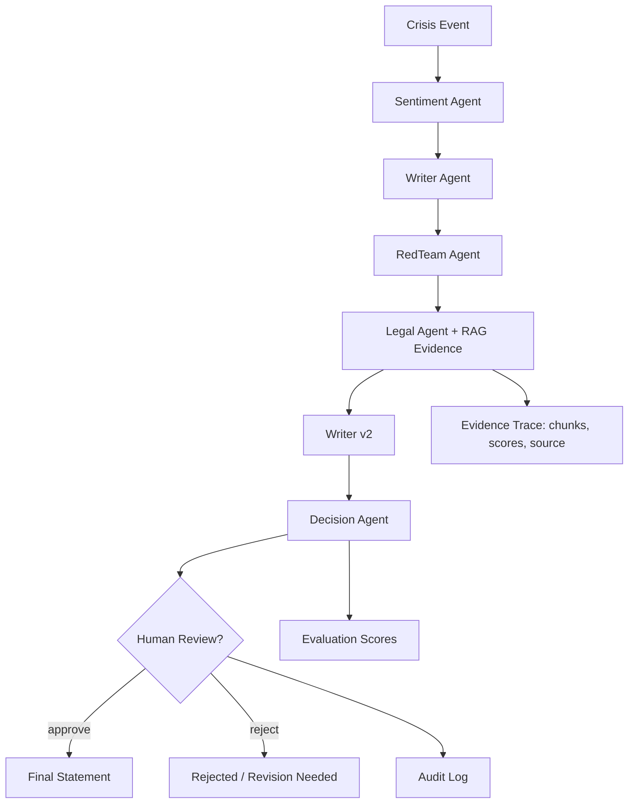
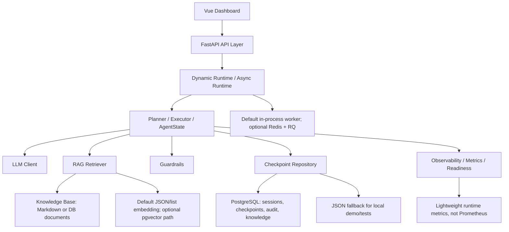

# CrisisAgent

CrisisAgent 是一个面向企业危机响应场景的 AI Agent 应用原型。它把一次危机事件拆解为舆情研判、声明生成、红队质疑、法律合规审查、二次修订、最终决策、人工审核和复盘观测等步骤，用 FastAPI、轻量 Dynamic Runtime、RAG、Checkpoint、Evaluation 和 Vue Dashboard 串成一套可运行的 MVP。

当前版本定位是 **production-ready prototype**：已经补充 PostgreSQL 持久化、Alembic migration、异步运行模式、Auth/RBAC、真实审核人审计、LLM fallback/Guardrails、RAG 知识库管理、Observability/Metrics/Readiness 等生产化基础能力，但不声明已经完成真实生产部署、SLA、高并发队列或线上大规模验证。

## Core Capabilities

- Multi-Agent workflow：Sentiment、Writer v1、RedTeam、Legal、Writer v2、Decision 分工执行。
- Dynamic Runtime：Planner 生成计划，Plan Validator 补齐依赖，Executor 通过 AgentState 串联各 Agent。
- Async Runtime：`RUNTIME_MODE=async` 下 `/api/dynamic/run` 返回 queued，可选 in-process worker 或 Redis + RQ worker 后台执行。
- Human Review：高风险、低评测分、LLM fallback 或 Guardrail 命中时进入人工审核。
- Checkpoint / Resume：支持 JSON fallback 与 PostgreSQL checkpoint backend。
- Legal RAG：Retrieval Need Gate v3 判断是否需要检索，Hybrid Retrieval + Domain-Aware RuleBasedReranker v2 提供法律上下文。
- LLM Reliability：OpenAI-compatible LLMClient 支持 timeout、retry、JSON repair、schema validation 和 mock fallback。
- Guardrails：检测 prompt injection 与高风险最终声明措辞。
- Auth / RBAC：`operator`、`legal_reviewer`、`admin` 三类角色，审核动作写入 audit log。
- Observability：structured logging、runtime metrics、`/health`、`/ready`。
- Dashboard：Vue3 前端展示 Crisis Case、风险等级、AI 声明、Human Review、Agent Trace、RAG/Gate Trace 和 Metrics。
- Tool / Skill Layer：轻量 `AgentSkill` registry、Function Calling adapter、MCP mock adapter 和 A2A message schema，用于解释工具协议边界。

## Tech Stack

- Backend：Python 3.11、FastAPI、Pydantic、SQLAlchemy、Alembic、httpx、pytest
- Runtime：自研轻量 Planner / Executor / AgentState / Checkpoint / Resume
- LLM：OpenAI-compatible API，真实 smoke 使用 DeepSeek
- RAG：Markdown fallback、Keyword Retriever、Hash/BGE Embedding、Hybrid Retriever、RuleBasedReranker
- Tooling：AgentSkill、OpenAI-compatible Function Calling schema、MCP-compatible mock spec、A2A message schema
- Database：PostgreSQL production path，JSON fallback for local tests/demo
- Frontend：Vue3、Vite、Axios
- Evaluation：pytest、离线 evaluator、Markdown report

## Architecture

### Business Agent Flow



Fixed workflow 仍保留在 `backend/workflow.py`，顺序固定为：

```text
Sentiment -> Writer v1 -> RedTeam -> Legal -> Writer v2 -> Decision
```

### Engineering Architecture



Dynamic Runtime 位于 `backend/core/`，通过 `AgentState` 保存 `session_id`、`plan_id`、`event`、`results`、`trace`、`approval`、`metadata` 和 `failed_agents`。

## Tool Calling / MCP / Skills Layer

Phase 16 增加了一层轻量工具协议抽象，主要用于解释 AI Agent 工程里几个容易混淆的概念：

- `AgentSkill`：项目内部的能力描述，包含 name、description、input/output schema、owner_agent、safety_level、enabled 和 version。
- Function Calling adapter：把 `AgentSkill` 转成 OpenAI-compatible `tools=[{type:function,...}]` schema，并支持输入校验、按 skill name 执行和 `tool_call_trace`。
- MCP adapter mock：把 `AgentSkill` 映射成 MCP-like tool/resource spec，并提供离线 mock call；当前不是完整 MCP runtime，也不连接真实 MCP server。
- A2A schema：用 `AgentMessage` 描述 Agent 与 Agent 之间传递 task/context/ack 的消息格式；当前主流程仍使用 `AgentState`。

内置 skills：

- `legal_rag_search`
- `session_lookup`
- `runtime_metrics_query`
- `guardrail_check`
- `knowledge_document_search`

详细说明见 `docs/tool-calling-mcp-skills.md`。

Tool-Using Legal Agent experiment:

```powershell
python scripts\run_tool_using_legal_demo.py
```

该 demo 展示受控 ReAct / Function Calling 思路：高风险事件必须调用 `legal_rag_search` 和 `guardrail_check`，低风险事件可以跳过 Legal RAG 但必须记录原因。它不会替换原 Legal Agent，不调用真实 MCP server，也不会让 LLM 自主执行 approve/reject/publish。详细说明见 `docs/tool-using-agent-design.md`。

## Reasoning Mode & Multi-turn Follow-up

Phase 17 增加轻量 reasoning mode selector，用来解释不同风险下的执行策略，但不改变现有 Agent 主流程：

- `fast`：低风险、无明显 RAG evidence 需求，减少审查深度。
- `standard`：正常多 Agent 流程，Legal RAG 由 Gate 控制。
- `strict`：高风险、Guardrail 命中、LLM fallback、低 RAG confidence 或用户要求严格审核时，建议强制 Legal RAG/Guardrail/Human Review。

Dynamic Runtime 会记录：

- `selected_reasoning_mode`
- `reasoning_mode_reason`
- `recommended_execution_policy`

多轮 follow-up：

```powershell
Invoke-RestMethod -Method Post `
  -Uri http://127.0.0.1:8000/api/dynamic/<session_id>/followup `
  -Body (@{ question="如果媒体追问下一步怎么办？"; followup_type="media_qna" } | ConvertTo-Json) `
  -ContentType "application/json"
```

Follow-up 默认 mock/offline，不消耗真实 LLM，会基于原始 event、final statement、scores、agent trace 和 RAG evidence 生成回答。详细说明见 `docs/reasoning-mode-and-multiturn.md` 和 `docs/long-form-generation.md`。

## Prompt Engineering & AI-assisted Development

项目补充了面试可解释材料，说明 Prompt、AI IDE 协作和代码知识库 Agent 的工程边界：

- `docs/prompt-engineering.md`：Role / Task / Context / Constraints / Output Schema / Examples，以及 Sentiment、Writer、RedTeam、Legal、Decision 各自的 prompt 设计重点。
- `docs/ai-assisted-development.md`：说明哪些工作由人主导，哪些由 AI 加速，以及如何通过范围约束、pytest、小 commit 和 diff review 避免 AI 乱改。
- `docs/code-knowledge-agent.md`：说明如何用静态 code index 辅助跨模块错误定位，以及它和真正 semantic code agent 的差距。

生成轻量代码知识库索引：

```powershell
python scripts\index_project_knowledge.py
```

输出：

```text
data/code_knowledge_index.json
```

## Quick Start

### Backend

```powershell
cd C:\path\to\CrisisAgent
python -m venv .venv
.\.venv\Scripts\Activate.ps1
pip install -r requirements.txt
python -m uvicorn backend.main:app --reload
```

Swagger:

```text
http://127.0.0.1:8000/docs
```

### Frontend

```powershell
cd frontend
npm install
npm run dev
```

Frontend:

```text
http://localhost:5173
```

### PostgreSQL Mode

JSON fallback is the default:

```powershell
$env:CHECKPOINT_STORAGE="json"
```

Use PostgreSQL:

```powershell
$env:CHECKPOINT_STORAGE="postgres"
$env:DATABASE_URL="postgresql+psycopg://<user>:<password>@localhost:5432/crisis_agent"
python -m alembic upgrade head
```

Docker Compose local PostgreSQL:

```powershell
docker compose up -d postgres
python -m alembic upgrade head
```

### Async Runtime

```powershell
$env:RUNTIME_MODE="async"
python -m uvicorn backend.main:app --reload
```

当前 async runtime 默认使用 in-process worker pool；也可以通过 `TASK_QUEUE_BACKEND=rq` 切换到 Redis + RQ。in-process 适合本地 demo；RQ 适合更接近生产的长任务执行。

## Environment Variables

`.env.example` 只包含 placeholder，不应写入真实 secret。

| Variable | Purpose |
|---|---|
| `AGENT_MODE` | `mock` or `llm` |
| `LLM_PROVIDER` | OpenAI-compatible provider |
| `LLM_MODEL` | LLM model name |
| `LLM_API_KEY` | Provider API key, never commit real value |
| `LLM_BASE_URL` | Provider base URL |
| `LLM_TIMEOUT_SECONDS` | HTTP timeout |
| `LLM_MAX_RETRIES` | LLM retry count |
| `CHECKPOINT_STORAGE` | `json` or `postgres` |
| `DATABASE_URL` | SQLAlchemy database URL |
| `RUNTIME_MODE` | `sync` or `async` |
| `TASK_QUEUE_BACKEND` | `inprocess` or `rq`; default is `inprocess` |
| `REDIS_URL` | Redis URL when `TASK_QUEUE_BACKEND=rq` |
| `RQ_QUEUE_NAME` | RQ queue name, default `crisisagent` |
| `RQ_JOB_TIMEOUT_SECONDS` | RQ job timeout |
| `AUTH_ENABLED` | `false` for demo, `true` for RBAC |
| `SECRET_KEY` | Required when `AUTH_ENABLED=true` |
| `EMBEDDING_MODEL` | `hash` or `bge` |
| `VECTOR_BACKEND` | `json` or optional `pgvector`; default `json` |
| `PGVECTOR_INDEX_TYPE` | Optional pgvector index hint: `ivfflat`, `hnsw`, or `none` |
| `PGVECTOR_DISTANCE` | Optional distance metric: `cosine` or `l2` |
| `KNOWLEDGE_DEFAULT_STATUS` | Documentation default for ingestion: `draft`, `published`, or `disabled` |
| `KNOWLEDGE_DEFAULT_ENABLED` | Documentation default for ingestion enabled flag |
| `HF_HOME` | Optional Hugging Face cache directory |
| `VITE_API_BASE_URL` | Frontend API base URL |

## API Examples

Health and readiness:

```powershell
Invoke-RestMethod http://127.0.0.1:8000/health
Invoke-RestMethod http://127.0.0.1:8000/ready
Invoke-RestMethod http://127.0.0.1:8000/api/metrics/runtime
```

Dynamic run:

```powershell
$body = @{ event = "某食品品牌被曝光使用过期原料，消费者要求监管介入。" } | ConvertTo-Json
$bytes = [System.Text.Encoding]::UTF8.GetBytes($body)
Invoke-RestMethod -Method Post `
  -Uri http://127.0.0.1:8000/api/dynamic/run `
  -Body $bytes `
  -ContentType "application/json; charset=utf-8"
```

Query sessions:

```powershell
Invoke-RestMethod http://127.0.0.1:8000/api/dynamic/sessions
Invoke-RestMethod http://127.0.0.1:8000/api/dynamic/<session_id>
Invoke-RestMethod http://127.0.0.1:8000/api/dynamic/<session_id>/metrics
```

Approve / reject:

```powershell
$approve = @{ reviewer = "enterprise-reviewer"; comment = "同意发布。" } | ConvertTo-Json
Invoke-RestMethod -Method Post `
  -Uri http://127.0.0.1:8000/api/dynamic/<session_id>/approve `
  -Body ([System.Text.Encoding]::UTF8.GetBytes($approve)) `
  -ContentType "application/json; charset=utf-8"
```

Auth:

```powershell
Invoke-RestMethod -Method Post `
  -Uri http://127.0.0.1:8000/api/auth/login `
  -Body (@{ username = "reviewer"; password = "<password>" } | ConvertTo-Json) `
  -ContentType "application/json"
```

## Demo

## Recommended Demo Path

推荐演示顺序：

面试或 GitHub 复现时，建议先走完全离线 mock demo，不消耗真实 LLM，也不依赖 PostgreSQL：

1. 使用 mock/json/sync 启动 backend：
   ```powershell
   $env:AGENT_MODE="mock"
   $env:CHECKPOINT_STORAGE="json"
   $env:RUNTIME_MODE="sync"
   python -m uvicorn backend.main:app --reload
   ```
2. 一键检查核心 demo：`python scripts\run_full_demo.py`
3. 打开 Dashboard：`cd frontend && npm run dev`
4. 在 Case Detail 展示 Human Review、Agent Trace、RAG Evidence、Guardrail 和 Metrics。

`run_full_demo.py` 默认使用 mock/offline 模式，不消耗真实 LLM。它会依次检查 `/health`、`/ready`、`/api/metrics/runtime`，然后运行 mock dynamic workflow、RAG evidence demo 和 RAG ablation demo。

如果你的本地 `backend/.env` 正在使用 `CHECKPOINT_STORAGE=postgres`，请先确认 PostgreSQL 依赖和数据库可用；只做离线 mock demo 时建议临时改为 `CHECKPOINT_STORAGE=json`。PostgreSQL demo 需要安装 `psycopg[binary]`，项目已在 `requirements.txt` 中声明，可通过 `pip install -r requirements.txt` 安装。

Mock demo:

```powershell
python scripts\run_demo_cases.py
```

Real LLM demo:

```powershell
$env:AGENT_MODE="llm"
python scripts\run_real_llm_demo.py
```

## RAG Evidence & Ablation

Legal Agent 的 RAG 不是只在最终回答里“看起来用了知识库”，而是会把证据链写入 trace，方便审计和面试展示。Legal trace 中重点字段包括：

- `rag_used`：本次 Legal 审核是否实际使用了 RAG evidence。
- `retrieval_backend`：证据来源路径，例如 `db`、`markdown` 或 `none`。
- `retrieval_query`：Legal Agent 实际送入检索器的 query。
- `evidence_chunks`：最终进入 Legal 审核上下文的证据片段。
- `chunk_id` / `document_id` / `document_version`：用于追踪证据来自哪份文档和哪个版本。
- `document_status` / `is_enabled` / `source_name`：说明证据是否来自已发布且启用的知识文档。
- `score` / `rerank_score`：检索分数和 rerank 后分数。
- `evidence_summary`：用一句话说明本次 RAG evidence 如何进入法律审核。

RAG on/off 对比 demo：

```powershell
python scripts\run_rag_ablation_demo.py
```

示例输出摘要：

```json
{
  "rag_disabled": {
    "rag_used": false,
    "retrieval_backend": "none",
    "evidence_chunks_count": 0
  },
  "rag_enabled": {
    "rag_used": true,
    "retrieval_backend": "markdown",
    "evidence_chunks_count": 3,
    "evidence_summary": "Legal Agent used 3 evidence chunks from markdown backend: food_safety.md."
  }
}
```

这个脚本对同一个危机事件分别运行 `RAG_ENABLED=false` 和 `RAG_ENABLED=true`，对比 `final_statement`、`legal_risks`、`safe_points`、`guardrail_triggered` 和 evaluation scores。当前示例中 RAG 开启后命中 `food_safety.md`，并在 trace 中展示 3 个 evidence chunks；关闭 RAG 时 `rag_used=false` 且 evidence 为空。

RAG retrieval evaluation:

```powershell
python scripts\evaluate_rag_retrieval.py
```

这个脚本读取 `data/rag_retrieval_eval_cases.json`，只评估检索本身是否命中期望 `source_category` 和关键词证据，不调用真实 LLM。输出报告位于：

- `reports/rag_retrieval_eval_report.json`
- `reports/rag_retrieval_eval_report.md`

它和 RAG ablation 的区别是：retrieval evaluation 看“有没有搜到正确来源和证据”，ablation 看“开启/关闭 RAG 后 Legal Agent 输出和最终声明有什么差异”。当前数据集是小型项目 holdout，不是公开 benchmark。

RAG bad case loop:

```powershell
python scripts\analyze_rag_bad_cases.py
```

这个脚本读取 `data/rag_bad_cases.json`，把 Phase 14 retrieval evaluation 暴露出的低命中样本沉淀成可跟踪的 bad case 台账，并按 `failure_type`、`root_cause`、`status` 聚合。报告输出：

- `reports/rag_bad_cases_report.md`

Knowledge ingestion regression:

```powershell
python scripts\run_knowledge_ingestion_regression.py
```

这个脚本离线验证知识库导入后的基本治理能力：document/chunk 数量、`chunk_id`、`document_version`、`source_category`、`status`、`is_enabled`、published/enabled 过滤、draft/disabled 不检索、embedding metadata 和 Markdown/JSON fallback。普通 demo 不依赖真实 PostgreSQL、pgvector 或真实 LLM。

BGE readiness:

```powershell
pip install -r requirements-bge.txt
$env:EMBEDDING_MODEL="bge"
$env:HF_HOME="<your-hf-cache-dir>"
python scripts\check_bge_readiness.py
```

Knowledge ingestion:

```powershell
python scripts\ingest_knowledge_base.py --path backend/rag/knowledge_base
python scripts\list_knowledge_documents.py
```

Governed ingestion:

```powershell
python scripts\ingest_knowledge_base.py `
  --path backend/rag/knowledge_base/data_privacy.md `
  --source-category data_privacy `
  --status published `
  --enabled true `
  --version 2
```

Legal RAG only loads database knowledge where `status=published` and `is_enabled=true`. Draft or disabled documents remain visible in the listing script but do not enter Legal Agent retrieval.

Optional pgvector vector backend:

```powershell
$env:CHECKPOINT_STORAGE="postgres"
$env:VECTOR_BACKEND="pgvector"
$env:PGVECTOR_DISTANCE="cosine"
$env:PGVECTOR_INDEX_TYPE="ivfflat"
python -m alembic upgrade head
python scripts\ingest_knowledge_base.py --path backend/rag/knowledge_base --embedding-model bge
```

`VECTOR_BACKEND=json` remains the default and stores embeddings as JSON/list data. `VECTOR_BACKEND=pgvector` is an optional productionization path that uses PostgreSQL `vector(512)` storage for BGE-style 512-dimensional embeddings. If pgvector is unavailable at runtime, vector retrieval falls back to the JSON vector store and marks the trace with `retrieval_backend=json_vector` plus `pgvector_fallback_used=true`.

## Testing

Current regression result:

```text
505 passed
```

Run locally:

```powershell
python -m pytest tests -q
```

Frontend build:

```powershell
cd frontend
npm run build
```

## Productionization Checklist

- PostgreSQL tables for sessions, checkpoints, traces, approvals, evaluations, audit logs and users.
- Alembic migrations for production state and auth/knowledge tables.
- JSON fallback remains available for local tests and demos.
- Async runtime supports queued background execution through in-process fallback or optional Redis + RQ durable queue.
- Auth/RBAC supports operator, legal reviewer and admin roles.
- Human Review records reviewer identity and audit logs.
- LLM layer records failure type, retry count, fallback flag and compact trace metadata.
- Guardrails detect prompt injection and unsafe final statements.
- Legal RAG supports gate skip, executed no-hit, executed with hits and retrieval error trace states.
- Knowledge management imports local Markdown/txt into database-managed documents/chunks.
- Runtime metrics and readiness endpoints support deployment checks.

## v3.0.0

v3.0.0 packages the project as a production-ready prototype:

- PostgreSQL checkpoint backend with Alembic migration.
- Auth/RBAC and real reviewer audit.
- Sync/async runtime modes.
- LLM reliability and guardrail layer.
- RAG knowledge management and retrieval audit metadata.
- Observability, runtime metrics and readiness checks.
- Final packaging docs for GitHub and interview demonstration.

## What Not To Overclaim

- The default async worker is in-process; Redis + RQ is optional and requires a separate worker process.
- Embeddings default to JSON/list storage; pgvector is optional and must be explicitly enabled.
- pgvector support is not an ANN/vector-database claim for the default demo path.
- Runtime metrics are lightweight in-app metrics, not Prometheus or OpenTelemetry.
- Reranker v2 is hand-written domain-aware rules, not a trained Cross Encoder.
- Real model smoke observed LLM fallback, so do not claim all agents always return valid structured JSON.
- This is a production-ready prototype and interview-grade AI application project, not an already deployed production service.
