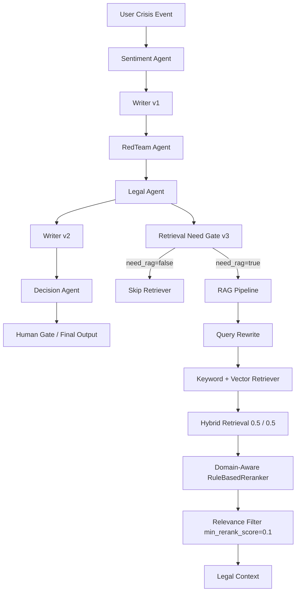
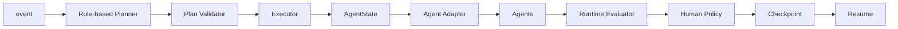

# CrisisAgent

CrisisAgent 是一个面向企业危机响应场景的 Multi-Agent AI 应用 Demo：它把一次危机事件拆成舆情判断、声明生成、红队质疑、法律合规审查、二次修订、最终决策和人工审核等步骤，并用 RAG、Trace、Evaluation 和 Dashboard 让过程可观察、可复现。

这个项目不是一个简单 Chatbot，也不是套用外部 Agent 编排框架的封装；当前实现是基于 Python、FastAPI、Vue3 和项目内自研的轻量 Agent Runtime。

## 项目简介

企业危机响应往往不是“让大模型直接写一段声明”就能结束。一个可用的 MVP 至少需要处理这些问题：

- 同一事件需要分别做情绪判断、事实谨慎表达、公众质疑检查、法律风险审查和最终发布决策。
- 合规审查需要参考知识库，但并不是所有 Legal 请求都应该检索 RAG。
- RAG 即使能召回正确文档，也可能混入错误领域上下文，例如数据隐私场景召回食品安全内容。
- 真实 LLM 输出可能不是稳定 JSON，因此需要 JSON parsing、字段校验和 fallback。
- 高风险事件需要人工审核和可追踪的执行记录。

CrisisAgent 当前支持两条运行方式：

- Fixed Workflow：固定顺序执行完整危机响应链路。
- Dynamic Runtime：Planner 生成计划，Plan Validator 补齐依赖，Executor 基于 AgentState 执行，并进入 Human Gate。

## 核心能力

- Multi-Agent Collaboration：Sentiment、Writer v1、RedTeam、Legal、Writer v2、Decision 分工协作。
- Legal RAG：Legal Agent 在 LLM 路径中可接入知识库检索，用于合规审查上下文增强。
- Retrieval Need Gate v3：在 Legal RAG 前判断当前任务是否真的需要 crisis-response RAG。
- Hybrid Retrieval：Query Rewrite、Keyword Retriever、BGE/Hash Vector Retriever、Hybrid Fusion、Domain-Aware RuleBasedReranker、relevance threshold。
- Human Review：高风险或策略触发时进入人工审核，可 approve / reject。
- Trace / Observability：记录 Agent Trace、RAG Trace、Gate Trace、fallback、sources、rerank scores。
- Evaluation：包含 Response Evaluation、RAG Baseline、Gate Challenge、Reranker Holdout、Final E2E Regression、Real Model Smoke。
- Vue3 Dashboard：以 Crisis Case 为核心展示风险、声明、审核、Agent Trace、RAG/Gate 信息和 Metrics。

## Architecture



Dynamic Runtime 额外包含：



## Fixed Workflow vs Dynamic Runtime

Fixed Workflow 位于 `backend/workflow.py`，真实顺序为：

```text
Sentiment Agent
-> Writer v1
-> RedTeam Agent
-> Legal Agent
-> Writer v2
-> Decision Agent
```

Dynamic Runtime 位于 `backend/core/`，主要模块为：

- `dynamic_runtime.py`：把 Planner、Validator、Executor 和 AgentState 串起来。
- `planner_agent.py`：当前是 deterministic / rule-based Planner，不是 LLM Planner。
- `plan_validator.py`：补齐依赖并固定执行顺序。
- `executor.py`：执行 Agent，写入 results、failed_agents 和 execution_trace。
- `state.py`：保存 session_id、plan_id、event、results、trace、approval 等共享状态。
- `human.py` / `policy.py`：处理人工审核状态流转。
- `checkpoint.py` / `resume.py`：本地 JSON checkpoint 和恢复。

## LLM Integration

LLM 基础设施位于 `backend/llm/`：

- `config.py`：读取 LLM 环境变量。
- `client.py`：OpenAI-compatible Chat Completions HTTP client。
- `parser.py`：JSON 解析、字段校验和异常处理。

当前通过 `AGENT_MODE` 切换：

- `AGENT_MODE=mock`：离线 mock / rule fallback，适合普通测试。
- `AGENT_MODE=llm`：调用 OpenAI-compatible API。项目真实 smoke 使用 DeepSeek。

重要限制：

- 当前没有 automatic LLM retry。
- 真实 DeepSeek smoke 中观察到 structured output format instability。
- 系统通过 JSON parsing、required-field validation 和 mock fallback 保证流程继续运行，但不能把 fallback 输出当作真实 LLM 全成功。

## Retrieval Need Gate

Gate v3 位于 `backend/rag/retrieval_need_gate.py`，是一个 Two-Layer Deterministic Gate：

```text
Current Incident Detector
-> Task Intent Rejector
-> Conservative Decision
```

它解决的问题不是“query 和知识库像不像”，而是：

> 当前 Legal 任务是否真的需要 crisis-response RAG？

示例：

- 当前真实危机、用户受影响、需要回应或处置：`need_rag=true`
- 培训、历史分析、模板写作、未来演练，且没有当前事件：`need_rag=false`

Gate Trace 会记录：

- `need_rag`
- `current_incident`
- `task_intent`
- `decision_path`
- `reason`
- `matched_signals`
- `negative_signals`

## RAG Pipeline

Legal Agent 通过 `backend/rag/retriever.py` 的兼容入口调用默认 pipeline：

```text
retrieve(query, top_k=3)
-> RagPipelineRetriever
-> Query Rewrite
-> HybridRetriever
-> RuleBasedReranker
-> min_rerank_score filter
-> RetrievalResult
```

RAG 模块主要文件：

- `backend/rag/retriever.py`：兼容入口，Agent 仍调用 `retrieve(query, top_k=3)`。
- `backend/rag/pipeline_retriever.py`：默认 RAG pipeline。
- `backend/rag/keyword_retriever.py`：关键词召回。
- `backend/rag/vector_retriever.py`：向量召回。
- `backend/rag/hybrid_retriever.py`：Keyword + Vector，默认权重 `0.5 / 0.5`。
- `backend/rag/reranker.py`：Domain-Aware RuleBasedReranker v2。
- `backend/rag/embedding.py`：`EMBEDDING_MODEL=hash|bge`。
- `backend/rag/knowledge_base/`：本地 Markdown 知识库。

BGE 配置：

- 模型：`BAAI/bge-small-zh`
- 库：`sentence-transformers`
- normalize：`normalize_embeddings=True`
- 向量维度：512

当前没有接入外部向量数据库、训练式重排模型或微调链路；RAG 仍保持本地轻量实现，便于观察和评测。

## Evaluation Journey

本项目保留了失败实验和 holdout 结果，避免只展示“好看数字”。

### Gate Evaluation

| Stage | Dataset | Result | Notes |
|---|---|---:|---|
| Gate v1 | Challenge v1 first frozen evaluation | FAIL | TPR = 0.20, TNR = 1.00 |
| Gate v2 | Challenge v2 first frozen evaluation | FAIL | TPR = 1.00, TNR = 0.80 |
| Gate v3 | Challenge v3 first frozen holdout | PASS | TP=19, TN=17, FP=3, FN=1 |

Gate v3 frozen holdout:

- Positive TPR：0.95
- Negative TNR：0.85
- Hard Negative Reject：10/12 = 0.8333
- End-to-End Recall@3：0.95
- No-hit Accuracy：0.85
- Context Pollution：0.3733

这不是完美 classifier：仍然有 3 个 FP 和 1 个 FN。

### Reranker Evaluation

Frozen Retrieval Holdout v1 中，唯一变量是 old reranker vs Domain-Aware Reranker v2：

| Metric | Old Reranker | Reranker v2 |
|---|---:|---:|
| Recall@3 | 0.90 | 0.90 |
| Context Pollution | 0.4722 | 0.3222 |
| Source Category Match | 0.4611 | 0.6278 |
| Pollution Relative Reduction | - | 31.77% |

这里的结论是：在 frozen holdout 上，Reranker v2 在保持 Recall@3=0.90 的同时降低了 cross-domain context pollution。它是手写规则 reranker，不是训练模型。

### Final E2E Regression

Final E2E Regression 记录在 `evaluation/reports/latest_final_e2e_regression.md`：

- pytest：398 collected / 398 passed
- Fixed Workflow：PASS
- Dynamic Runtime：PASS
- Gate Skip：PASS
- Gate Hit：PASS
- Gate True + No Hit：PASS
- Retriever Exception / Fallback：PASS
- LLM Failure Fallback：PASS
- Human Gate：PASS
- Session Persistence：PASS
- Trace：PASS
- Frontend Build：PASS

398 是测试数量，不是 coverage。

### Real DeepSeek + BGE Smoke

Real model smoke 记录在 `evaluation/reports/latest_real_llm_bge_smoke.md`：

- Status：`PASS_WITH_LLM_FALLBACK_OBSERVED`
- DeepSeek：`deepseek-v4-flash`
- BGE：`BAAI/bge-small-zh`，512 dim，float32，normalized，无 NaN/Inf
- Hash fallback：false
- Smoke A：Dynamic Runtime 完整执行，Legal Gate `need_rag=true`，retrieval `executed_with_hits`，sources 包含 `food_safety.md`
- Smoke B：Gate Skip，retriever call count = 0，`retrieval_status=skipped_by_gate`

必须注意：

- Smoke A 中 RedTeam 真实 DeepSeek 请求发生，但因缺少 `suggestions` 字段触发现有 mock fallback。
- Smoke B 中 Legal DeepSeek HTTP 200，但 JSON parsing 失败并触发现有 mock fallback。
- 因此不能表述为所有 Agent 真实 LLM 稳定成功，也不能表述为 production reliability。

## Trace / Observability

Legal RAG trace 可以区分：

- Gate Skip：`retrieval_skipped=true`，`retrieval_executed=false`
- Executed No Hit：`retrieval_executed=true`，`count=0`
- Executed With Hits：`retrieval_executed=true`，`count>0`
- Retrieval Error：`retrieval_status=retrieval_error`，`fallback_used=true`

常见 trace 字段：

- Gate：`need_rag`、`current_incident`、`task_intent`、`decision_path`、`reason`
- Retrieval：`sources`、`scores`、`rerank_scores`、`count`、`fallback_used`
- Agent：`start_time`、`end_time`、`duration_ms`、`input_summary`、`output_summary`、`error`

## Frontend Dashboard

前端位于 `frontend/`，使用 Vue3 + Vite + Axios。

当前 Dashboard 以 Crisis Case 为中心：

- 首页：案例列表和统计卡片。
- 创建页：输入事件并创建动态任务。
- 详情页：风险等级、当前状态、AI 声明、Human Review。
- 高级分析：Agent Trace、RAG、Retrieval Gate、Memory、Metrics、Raw JSON。

`frontend/src/components/AdvancedAnalysis.vue` 对旧 session 缺少新 Gate 字段的情况做了 optional-field handling，不会因为历史数据没有 `rag.gate` 而崩溃。

## Quick Start

### Prerequisites

- Python 3.11
- Node.js + npm
- Windows PowerShell 示例优先；Linux/macOS 命令可按 shell 语法调整。

### Backend

```powershell
python -m venv .venv
.\.venv\Scripts\Activate.ps1
pip install -r requirements.txt
```

启动 FastAPI：

```powershell
uvicorn backend.main:app --reload
```

Swagger：

```text
http://127.0.0.1:8000/docs
```

### Frontend

```powershell
cd frontend
npm install
npm run dev
```

访问：

```text
http://localhost:5173
```

### Optional BGE Setup

普通测试默认不需要 BGE。若要运行真实 BGE：

```powershell
pip install -r requirements-bge.txt
$env:EMBEDDING_MODEL="bge"
$env:HF_HOME="<your-hf-cache-dir>"
python scripts\check_bge_readiness.py
```

`HF_HOME` 可换成自己的本地缓存目录；不要把模型缓存提交到 Git。

## Environment Variables

`.env.example` 中提供了安全 placeholder。常用变量：

| Variable | Purpose |
|---|---|
| `AGENT_MODE` | `mock` 或 `llm` |
| `LLM_PROVIDER` | 当前支持 OpenAI-compatible API |
| `LLM_API_KEY` | LLM API Key，不要提交真实值 |
| `LLM_BASE_URL` | OpenAI-compatible base URL |
| `LLM_MODEL` | 例如 `deepseek-v4-flash` |
| `LLM_TIMEOUT_SECONDS` | LLM HTTP timeout |
| `EMBEDDING_MODEL` | `hash` 或 `bge` |
| `CORS_ORIGINS` | FastAPI CORS origins |
| `VITE_API_BASE_URL` | 前端 API base URL |

## API

| Method | Path | Purpose |
|---|---|---|
| GET | `/health` | Backend health check |
| POST | `/api/crisis/run` | Run fixed workflow |
| GET | `/api/crisis/sessions` | List fixed workflow sessions |
| GET | `/api/crisis/sessions/{session_id}` | Get fixed workflow session |
| POST | `/api/dynamic/run` | Run dynamic runtime |
| GET | `/api/dynamic/sessions` | List dynamic sessions/checkpoints |
| GET | `/api/dynamic/{session_id}` | Get dynamic session state |
| GET | `/api/dynamic/{session_id}/metrics` | Get dynamic runtime metrics |
| POST | `/api/dynamic/{session_id}/approve` | Approve Human Gate session |
| POST | `/api/dynamic/{session_id}/reject` | Reject Human Gate session |

Minimal request:

```json
{
  "event": "某食品品牌被曝光使用过期原料，相关视频在网络传播，消费者要求监管介入。"
}
```

## Project Structure

```text
backend/
  agents/          # Sentiment, Writer, RedTeam, Legal, Decision, Planner
  core/            # Dynamic Runtime, Executor, AgentState, Human Gate, Checkpoint
  rag/             # Retriever abstraction, Hybrid RAG, Gate, Reranker, embeddings
  llm/             # OpenAI-compatible LLM client and JSON parser
  memory/          # Local crisis memory storage/retrieval
  tools/           # Tool abstraction and sample tools
  context/         # ContextManager
evaluation/
  reports/         # Reproducible evaluation and smoke reports
frontend/
  src/             # Vue3 Dashboard
scripts/           # Demo, smoke, readiness and evaluation scripts
tests/             # pytest test suite
```

## Testing

Offline-safe tests:

```powershell
python -m pytest -q
```

Workflow smoke:

```powershell
python scripts\test_workflow.py
python scripts\test_dynamic_runtime.py
```

Frontend build:

```powershell
cd frontend
npm run build
```

Real model checks require external model/API environment:

```powershell
$env:AGENT_MODE="llm"
$env:EMBEDDING_MODEL="bge"
$env:HF_HOME="<your-hf-cache-dir>"
python scripts\check_bge_readiness.py
python scripts\run_real_llm_demo.py
```

不要把真实 API Key 写入 README、报告或 Git。

## Demo

内置 demo case 位于 `demo/cases.json`，脚本：

```powershell
python scripts\run_demo_cases.py
```

适合面试演示的流程：

1. 打开 Dashboard 首页，说明系统以 Crisis Case 为核心。
2. 新建食品安全或数据隐私事件。
3. 进入详情页，展示风险等级、AI 声明和 Human Review。
4. 展开高级分析，展示 Legal Agent 的 Gate / RAG Trace。
5. 说明 Evaluation 中保留了失败实验和 frozen holdout，而不是只展示最终数字。

## Known Limitations

1. `legal_agent._LAST_RAG_INFO` 仍是 module-level state，并发请求存在 trace isolation 风险。
2. Reranker v2 是 hand-written domain-aware rules，对新领域和隐式表达的泛化有限。
3. Gate v3 在 frozen Challenge v3 中仍有真实 FP/FN，不是完美分类器。
4. Real DeepSeek smoke 中观察到 structured output format instability，系统依赖 validation + fallback 继续运行。
5. 当前没有 automatic LLM retry。
6. 本项目是 AI 应用开发 / Agent Runtime / RAG Evaluation 的面试展示级 Demo，不声明生产可用、服务等级或高并发能力。

## What Not To Overclaim

如果在简历或面试中介绍，请只基于本 README、代码和 `evaluation/reports/` 中真实可复现的结果。不要把项目描述成使用了仓库中没有实现的外部编排框架、消息队列、数据库、向量数据库、微调能力或大规模线上服务。
