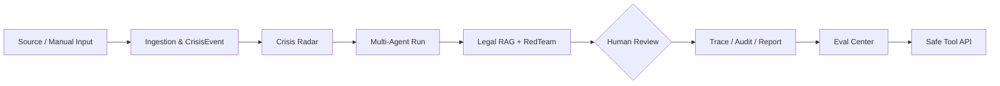

# CrisisAgent

This is a live-news-driven, Watchlist-based monitoring and crisis-response Agent Harness. It is a controlled engineering prototype, not an unrestricted crawler, automatic publisher, or production SaaS.

## Live-News-Driven Crisis Response Copilot

CrisisAgent is a live-news-driven, evidence-guided crisis response workbench for enterprise PR, legal, and quality teams. It can turn controlled news-source signals or manually entered incidents into prioritized, reviewable, traceable response drafts, legal-risk notes, and audit-ready reports.

It is **not** a whole-web crawler, an automatic PR publishing system, or a one-shot LLM demo. Live collection is optional and manually enabled; the MVP keeps evidence, risk signals, review decisions, and execution traces visible throughout a crisis-response workflow.

## What It Does

```text
Source / Manual Input
    -> CrisisEvent
    -> Crisis Radar
    -> Agent Run
    -> Legal & RedTeam Review
    -> Human Review
    -> Trace / Report
    -> Eval Center
    -> Safe Tool API
```

- Manage allowlisted RSS, GDELT DOC, NewsAPI, or single-article sources, and configure Watchlist-driven monitoring for companies, brands, and products.
- Evaluate monitoring mentions, risk alerts, duplicates, and bad cases with deterministic offline golden cases.
- Normalize, deduplicate, cluster, and risk-tag opinion signals into a `CrisisEvent`.
- Run a fixed multi-agent response workflow: Sentiment, Writer, RedTeam, Legal, Writer V2, and Decision.
- Use Legal RAG evidence, retrieval quality signals, and guardrails to support conservative review.
- Use reviewed case memory and deterministic ContextPack previews to control long-context inputs without changing the core Agent workflow.
- Require human review for high-risk, unverified, conflicting, guardrail-hit, or low-evidence-confidence cases.
- Inspect Trace, review status, audit records, reports, evaluation results, and safe read-only tool calls in the Vue Workbench.

## Architecture



The product flow is separate from the safety controls: source collection is allowlisted and disabled by default; high-risk outputs are drafts, not publications; and external tool access is restricted to an audited, read-only allowlist.

## Tech Stack

- **Backend:** Python 3.11, FastAPI, Pydantic, SQLAlchemy/Alembic
- **Workbench:** Vue 3, Vite, Axios
- **Agent runtime:** fixed multi-agent workflow, Dynamic Runtime, AgentState, Checkpoint/Resume
- **RAG and safety:** Legal RAG, retrieval gate, evidence quality gate, RedTeam, Guardrails, Human Review
- **Reliability:** ToolRunner, execution budget, Redis/RQ background ingestion, retry, dead-letter, heartbeat, stuck-run recovery
- **Product controls:** RBAC, audit log, Crisis Radar, Eval Center, offline CI gate, HTTP Safe Tool API

## Safety Boundaries

- No whole-web crawling, recursive crawling, login bypass, CAPTCHA bypass, proxy pools, or personal-data collection.
- Live collection is manual, allowlisted, HTTPS-only, timeout/rate-limited, and disabled by default. RSS/article connectors are robots-aware; API connectors do not crawl webpages.
- The system creates response **drafts**; `automatic_publish=false` is preserved across the product flow.
- Sensitive actions such as approve, reject, publish, notification, deletion, knowledge-base modification, live-fetch, and workflow execution are not exposed through the external Tool API.
- The default local path uses mock/json/sync/hash settings. Optional PostgreSQL, Redis/RQ, BGE, and real LLM modes are not required for the offline demo.

## Quick Start

### Docker demo

```powershell
docker compose up --build
```

Open the Workbench at `http://localhost:5173`. The default Compose configuration uses mock agents, JSON storage, synchronous runtime, and no live-fetch.

```powershell
docker compose down
```

### Local development

```powershell
python -m venv .venv
.\.venv\Scripts\Activate.ps1
python -m pip install -r requirements.txt
$env:AGENT_MODE="mock"
$env:CHECKPOINT_STORAGE="json"
$env:RUNTIME_MODE="sync"
python -m uvicorn backend.main:app --reload
```

```powershell
cd frontend
npm install
npm run dev
```

Run the offline regression suite:

```powershell
python -m pytest tests -q
python scripts\run_eval_center.py --pretty --min-pass-rate 0.8
```

## Documentation

- [Architecture overview](docs/ARCHITECTURE_OVERVIEW.md)
- [Controlled connectors and live ingestion](docs/CONTROLLED_CONNECTORS.md)
- [Live news ingestion](docs/LIVE_NEWS_INGESTION.md)
- [Queue reliability](docs/QUEUE_RELIABILITY.md)
- [HTTP Tool API](docs/HTTP_TOOL_API.md)
- [Eval CI gate and golden cases](docs/EVAL_CI_GATE.md)
- [Project boundaries](docs/PROJECT_BOUNDARIES.md)
- [Workspace security and audit](docs/WORKSPACE_SECURITY_AUDIT.md)
- [Product MVP roadmap](docs/PRODUCT_MVP_ROADMAP.md)

For an interview-friendly summary: CrisisAgent is a **human-in-the-loop crisis-response Copilot MVP**, not an autonomous public-publishing system or a production SaaS claim.
