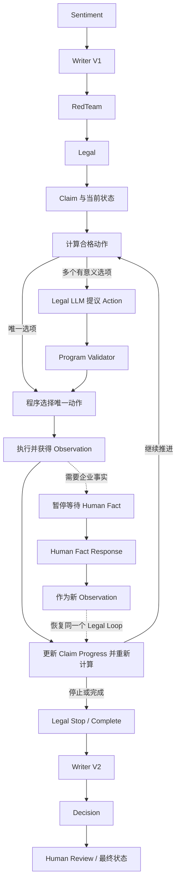
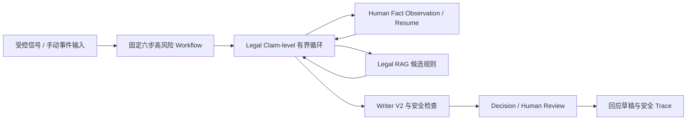

# CrisisAgent

**面向企业危机响应的可审计、多 Agent 决策系统。** CrisisAgent 将高风险响应拆成固定审核流程，并在 Legal 阶段通过有界的 Claim、Action 与 Observation 推进任务，最终生成供人审核的回应草稿；它不是自动发布系统。

## 1. 为什么做 CrisisAgent

危机回应不只是把事件改写成一段声明：输入事实可能尚未确认，适用的法律规则可能需要检索，模型也可能写出没有依据的具体承诺。高风险步骤不能被模型随意跳过；人工补充信息后，系统还需要从可恢复的位置继续原任务，并保留可审计的过程记录。

因此，项目关注的问题是：**如何让 LLM 在固定安全流程中处理不完整信息，同时允许必要的局部决策，又不把执行权交给模型。**

## 2. 核心设计：固定外层，受控内层

外层保持固定的六步审核顺序：

```text
Sentiment → Writer V1 → RedTeam → Legal → Writer V2 → Decision
```

固定的是高风险审核步骤，不是模型输出。系统不会因为一次模型判断就跳过 Legal、RedTeam 或人工审核。当前重点做深的是 Legal 阶段：它把声明中的 Claim 与各自需要的企业事实或法律规则依据分开处理，在有限轮数和工具预算内推进。


```mermaid
flowchart TD
    S[Sentiment] --> W1[Writer V1]
    W1 --> R[RedTeam]
    R --> L[Legal]
    L --> C[Claim 与当前状态]
    C --> E[计算合格动作]
    E -->|多个有意义选项| P[Legal LLM 提议 Action]
    E -->|唯一选项| X[程序选择唯一动作]
    P --> V[Program Validator]
    V --> X
    X --> O[执行并获得 Observation]
    O --> U[更新 Claim Progress 并重新计算]
    U -->|继续推进| E
    U -->|停止或完成| LS[Legal Stop / Complete]
    LS --> W2[Writer V2]
    W2 --> D[Decision]
    D --> G[Human Review / 最终状态]
    O -. 需要企业事实 .-> HW[暂停等待 Human Fact]
    HW --> HR[Human Fact Response]
    HR --> HO[作为新 Observation]
    HO -. 恢复同一个 Legal Loop .-> U
```

## 3. Legal Agent Deep Dive

Legal 内部不是一次检索后就结束，而是一个**受控的、基于 Observation 的有界任务推进**：

```text
Claim / 当前状态
  → 计算 eligible actions
  → 唯一动作时按程序规则处理；多个有意义动作时请求 Legal LLM 提议
  → Program Validator 校验
  → 执行动作
  → Observation
  → 更新 Claim Progress 并重新计算
  → 下一 Claim、继续处理或安全停止
```

**模型拥有提议权，程序拥有执行权。** 模型不能自由调用任意工具。程序限制 Action 白名单、动作资格、轮数与工具预算、重复动作、停止条件和 Human Review 边界；不合法或不安全的提议不会被执行。Trace 记录必要的结构化动作与状态信息，不要求或保存 Chain-of-Thought。

这不是 General ReAct，也不是通用自主规划 Agent。Legal 的多轮范围有界，外层六步 Workflow 不由模型重排。

## 4. Human Fact 与 Legal RAG

两类缺口走不同路径：

| 缺口 | 处理方式 | 能回答什么 |
|---|---|---|
| 企业个案事实未知，例如企业是否已经通知相关方 | Human Fact | 请求人工补充当前企业事实 |
| 法律规则或危机回应规范未知 | Legal RAG | 检索候选法律规则或相关规范材料 |

法律知识库不能证明企业内部事实，也不能据新闻、用户描述或检索分数认定某个企业事实成立。`FACT_PROVIDED` 只记录为 `human_asserted`，不会自动升级为 `independently_verified`。

人工回复会形成新的 Observation，并恢复同一次 Legal Task 的保存游标；它不是重跑整个 Workflow。Legal 停止后，任务才进入原有 Writer V2、安全检查、Decision 和 Human Review 路径。

## 5. 一次真实 Bad Case 如何推动改进

food-01 的早期真实运行暴露出一个任务级断点：首个 Claim 收到 `FACT_UNAVAILABLE` 后，Legal Task 因 Human Fact guard 提前停止，后续 Claim 没有机会继续处理。最终定位聚焦在 **Claim progression cursor 缺失、Human Fact guard 范围过大，以及 Task-level stop 过早**，而不是把 Claim Extraction 当作该断点的根因。

在有界 Claim progression 修复后的 Trigger Replay 中，行为变为：

```text
Claim 0 → Human Fact → FACT_UNAVAILABLE → Observation → 更新进度
Claim 1 → Human Fact → FACT_UNAVAILABLE → Observation → 更新进度
Claim 2 → Human Fact → FACT_UNAVAILABLE → Observation
       → 轮数预算耗尽 → Final Review
```

同一个 Case 不再因第一个未解决事实缺口而立刻阻断后续 Claim。它仍受轮数预算约束并进入人工审核，不代表系统解决了所有事实问题。

旧 run 的 Claim Extraction Provider 调用发生 timeout 并使用 fallback；新 run 的 Provider 调用和结构化解析成功。这次 Replay 证明旧 blocker 在新的真实运行中没有再次出现，并观察到 bounded multi-Claim continuation，但它不是严格控制变量的 A/B，不能把所有输出差异都归因于 Legal V3 修改。

## 6. 这次真实 Replay 证明了什么

### 已观察到

- 确定性测试覆盖了有界多阶段推进、Human Fact Observation 恢复和 Claim-level progression。
- 一次 food-01 Real Provider Trigger Replay 中，Claim Extraction 完成真实 Provider 调用与结构化解析；任务在收到多次 `FACT_UNAVAILABLE` 后继续处理不同 Claim，并最终受预算限制进入 Final Review。
- 该次 Replay 中模型提议经过 Validator 接受，但提议与 deterministic baseline 的动作选择一致。

### 尚未证明

- 真实模型能在不同任务推进策略间稳定选择，或 Proposal 优于 deterministic policy（Capability B）。
- 通用自主规划、General ReAct，或 Legal Retrieval 多阶段真实链路。
- Claim Extraction 对各种真实事件都语义正确。
- 外部真实用户验证或统计意义上的 Real LLM benchmark。

这是**一个 Case 的能力验证，不是 benchmark 或统计性结论**。详见 [Real LLM Eval Harness](docs/REAL_LLM_EVAL_HARNESS.md)。

## 7. State、Context 与可观测性

- **AgentState**：当前任务状态、业务结果和 Agent 输出。
- **ContextPack**：为当前 Agent 选择的上下文，而非整个运行历史。
- **Trace**：用于诊断与审计的安全结构化过程摘要。
- **Checkpoint**：暂停和恢复所需的运行状态与游标。

Trace 默认不复制完整 Event、Prompt、Evidence 正文、Human Fact 回答或模型原始响应。Checkpoint 支持任务暂停与恢复，但不代表跨进程外部 Provider 调用具备 exactly-once 保证。

## 8. Evaluation Evidence

- **Engineering Regression**：最近一次完整离线回归为 **1078 passed, 1 skipped**。这是工程回归证据，不是 Agent 语义质量指标。
- **Frozen Evaluation**：冻结 Case 和数据集 identity，用于在一致输入条件下复现或比较运行；固定集结果不等于外部 benchmark。
- **Real Provider Evaluation**：food-01 完成一次 Trigger Replay，支持“真实 Provider 下观察到有界多 Claim continuation”这一窄结论，不代表模型策略优越或整体质量已验证。
- **User 0 Browser E2E**：已完成内部浏览器端到端使用验证；这不是外部真人测试。外部真实用户验证尚未进行。

## 9. Supporting Engineering Capabilities

以下能力服务于主线，但不是本项目当前要主张的自主决策能力：

- **Legal RAG**：为 Legal 提供候选规则材料；不验证企业内部事实。
- **Skills / MCP Safe Adapter**：提供受控能力描述与安全适配边界，不开放任意工具执行。
- **Case Memory / ContextPack**：管理经筛选的历史案例摘要与角色化上下文。
- **Harness Evolution**：候选配置经评测和人工审批后才可能启用；已有候选也可以被拒绝。这不是模型自我训练或自我进化。
- **Runtime Reliability**：支持异步任务、状态持久化与恢复；多进程 exactly-once 和崩溃恢复仍有边界。
- **Live News / Watchlist / Crisis Radar**：可选的受控信号采集与事件组织能力，不是 Legal V3 结论的验证来源。

## 10. Architecture


```mermaid
flowchart LR
    I[受控信号 / 手动事件输入] --> F[固定六步高风险 Workflow]
    F --> L[Legal Claim-level 有界循环]
    L --> HF[Human Fact Observation / Resume]
    L --> RAG[Legal RAG 候选规则]
    HF --> L
    RAG --> L
    L --> W[Writer V2 与安全检查]
    W --> H[Decision / Human Review]
    H --> O[回应草稿与安全 Trace]
```

## 11. Quick Start

默认启动方式适用于本地 Mock/Demo，不代表生产部署配置。

### Docker Demo

```powershell
docker compose up --build
```

打开 `http://localhost:5173`。默认 Compose 使用 Mock Agent、JSON 存储、同步 Runtime，不启用 Live Fetch。

```powershell
docker compose down
```

### Local Development

```powershell
python -m venv .venv
.\.venv\Scripts\Activate.ps1
python -m pip install -r requirements.txt
$env:AGENT_MODE="mock"
$env:CHECKPOINT_STORAGE="json"
$env:RUNTIME_MODE="sync"
python -m uvicorn backend.main:app --reload
```

另开终端启动前端：

```powershell
cd frontend
npm install
npm run dev
```

运行离线工程回归：

```powershell
python -m pytest tests -q
python scripts\run_eval_center.py --pretty --min-pass-rate 0.8
```

## 12. Limitations

- 尚无外部真实用户验证；User 0 内部 E2E 不等于外部用户测试。
- Legal 是有界任务推进，不是通用自主规划或 General ReAct。
- Claim Extraction 未被证明在所有事件类型上语义正确。
- 单次 Real Provider Case 不是 benchmark，也不能证明 Proposal 优于 deterministic baseline。
- `FACT_PROVIDED` 是人工陈述，不是独立事实核验。
- 不保证 Provider 外部调用 exactly-once；进程崩溃恢复和多进程并发安全仍有边界。
- 项目没有完成完整生产环境部署，不应称为生产级系统。

## 13. Documentation

- [Architecture overview](docs/ARCHITECTURE_OVERVIEW.md)
- [Legal Action / Observation Loop](docs/LEGAL_ACTION_OBSERVATION_LOOP.md)
- [Real LLM Evaluation Harness](docs/REAL_LLM_EVAL_HARNESS.md)
- [Evaluation methodology](docs/evaluation-methodology.md)
- [HarnessSpec](docs/HARNESS_SPEC.md)
- [Runtime reliability](docs/AGENT_RELIABILITY.md)
- [Project boundaries](docs/PROJECT_BOUNDARIES.md)
- [Controlled connectors and live ingestion](docs/CONTROLLED_CONNECTORS.md)
- [HTTP Tool API](docs/HTTP_TOOL_API.md)
- [Harness proposals](docs/HARNESS_PROPOSALS.md)
- [Workspace security and audit](docs/WORKSPACE_SECURITY_AUDIT.md)

For interviews: CrisisAgent is a controlled crisis-response Agent system whose central engineering story is the bounded Legal task loop—not unrestricted autonomy or automatic publication.
