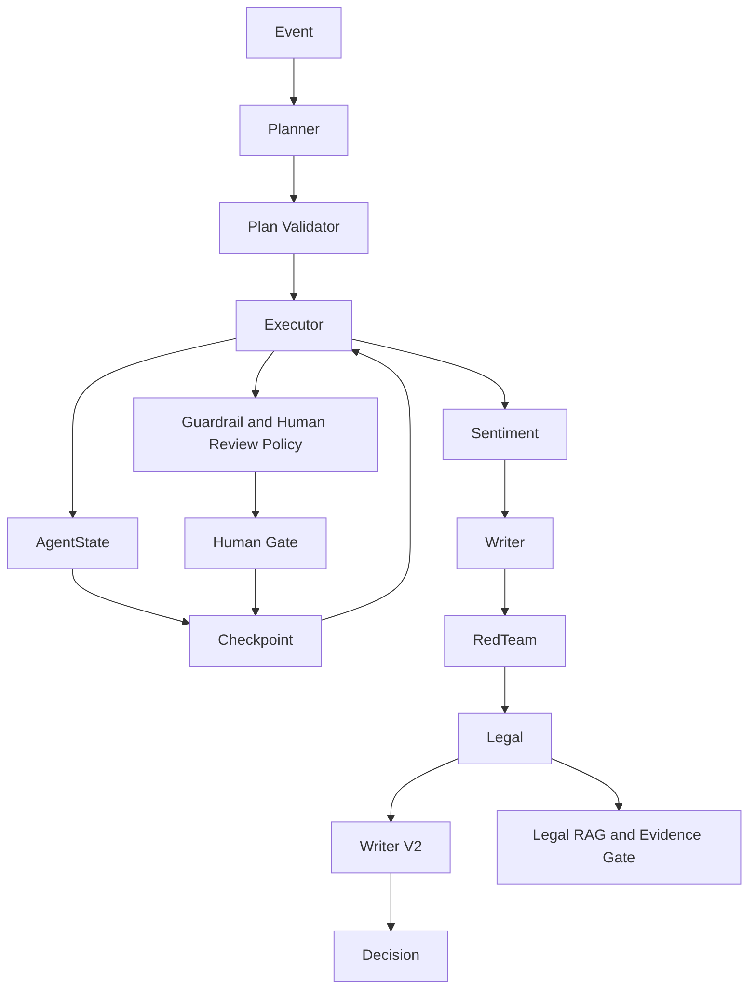
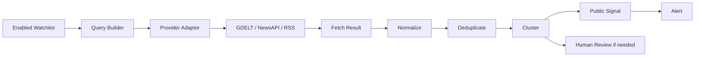
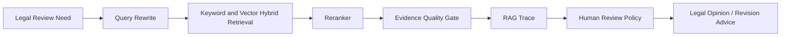

# Architecture Overview

## Product Flow

```text
Source / Manual Input
-> Ingestion Run
-> Clustered CrisisEvent
-> Crisis Radar
-> Agent Run
-> Legal & RedTeam Review
-> Human Review
-> Trace / Report
-> Eval Center
-> Safe Tool API
```

Source can be local fixture data, an allowlisted RSS/single-article connector, or a manually entered event. The ingestion path normalizes, deduplicates, clusters, and risk-tags records before an operator promotes a cluster into a durable CrisisEvent.

## Response Flow

The fixed business workflow remains:

```text
Sentiment -> Writer -> RedTeam -> Legal -> Writer V2 -> Decision
```

AgentState carries event context, results, trace, metadata, approval state, and failure signals. Dynamic Runtime adds planning, checkpointing, resume, and policy evaluation without replacing the fixed workflow business sequence.

## Evidence And Review

Legal RAG uses retrieval gating, hybrid retrieval, reranking, evidence metadata, and an evidence-quality gate. High-risk, unverified, conflicting, guardrail-hit, or low-confidence evidence can require Human Review. Approval applies only to the reviewed trace scope; new risks after resume are evaluated again.

## Product Controls

- Crisis Radar prioritizes events with explainable urgency rules.
- RBAC and Audit Log provide MVP workspace controls.
- Redis/RQ is optional for background ingestion; JSON remains the offline demo fallback.
- HTTP Tool API exposes only audited, read-only safe tools through the existing ToolRunner.

## End-to-End Business Flow

```mermaid
flowchart LR
    A[Source or Manual Input] --> B[Watchlist / Source Registry]
    B --> C[Ingestion Run]
    C --> D[Normalize and Deduplicate]
    D --> E[Cluster and Risk Analyze]
    E --> F[CrisisEvent]
    F --> G[Crisis Radar]
    G --> H[Agent Run]
    H --> I[Legal and RedTeam Review]
    I --> J[Human Review]
    J --> K[Trace and Report]
    K --> L[Eval Center]
    L --> M[Safe Tool API]
```



This flow is an operator-facing product loop. Live monitoring is allowlisted and opt-in; it is not unrestricted crawling or automatic publication.

## Agent Harness



The Harness controls planning, state, checkpoint, policy, trace, and recovery around the fixed business workflow. It does not make the business workflow fully autonomous.

## Watchlist Live Monitoring



Only explicitly enabled, allowlisted providers are eligible. Scheduled execution is disabled by default; a live cycle does not run an Agent or publish a statement automatically.

## Legal RAG Evidence Flow



The RAG flow preserves evidence metadata and can lower confidence or request Human Review. The live monitoring path and the RAG path are separate concerns.

See docs/ for component-level design notes; this document is an overview, not a production deployment claim.
