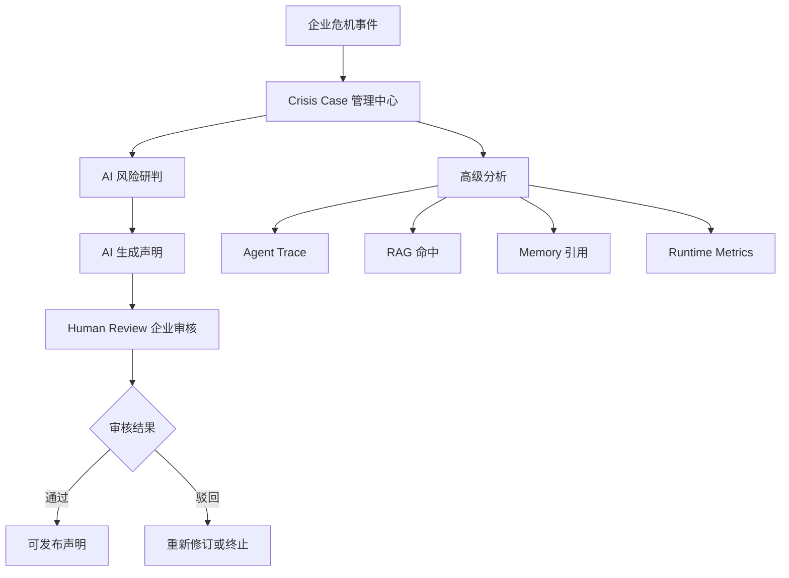
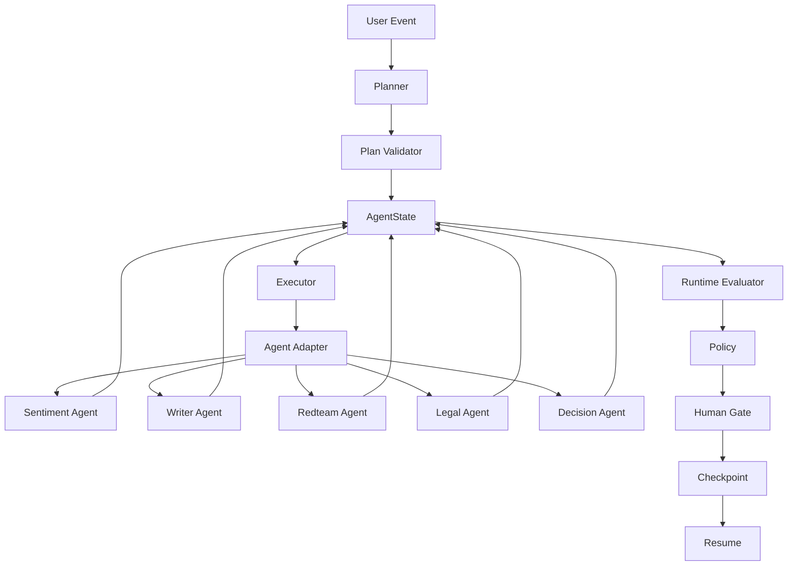
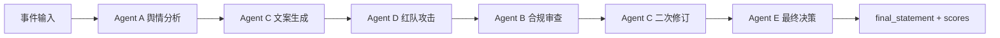
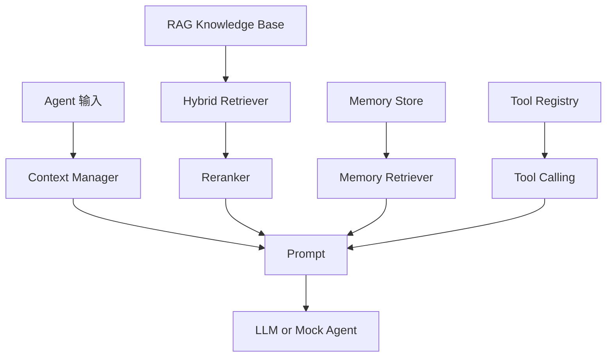
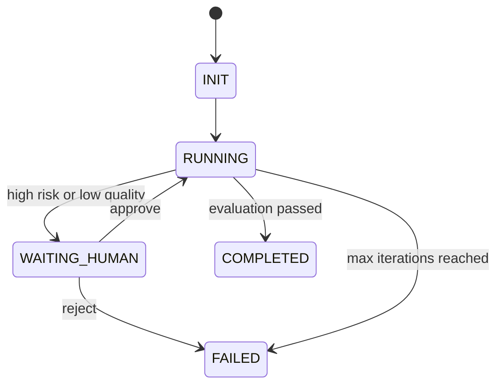
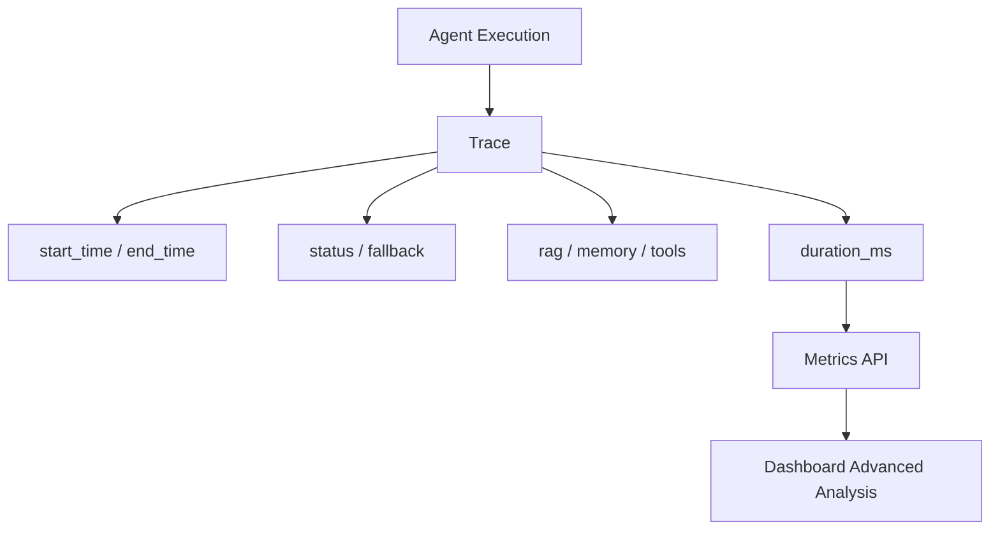

# CrisisAgent Architecture Diagram

本文档用图示方式说明 CrisisAgent 的产品结构、Dynamic Runtime、Agent 协作和可观测链路，方便 GitHub 展示和面试讲解。

## 1. 产品视角

## 2. Dynamic Runtime 架构

## 3. Agent 协作链路

## 4. RAG / Memory / Tools 位置

## 5. Human Gate 与 Resume

## 6. Observability

## 面试讲解重点

- 系统不是单 LLM，而是一个可编排 Agent Runtime。
- Agent 之间不直接互相调用，而是通过 AgentState 共享结果。
- RAG 放在 Legal Agent，Memory 放在 Writer Agent，职责边界清晰。
- Human Gate 保证高风险场景不会完全自动化发布。
- Checkpoint Resume 让审核中断后的 runtime 可以恢复。
- Dashboard 面向业务用户，高级分析面向开发和调试。
