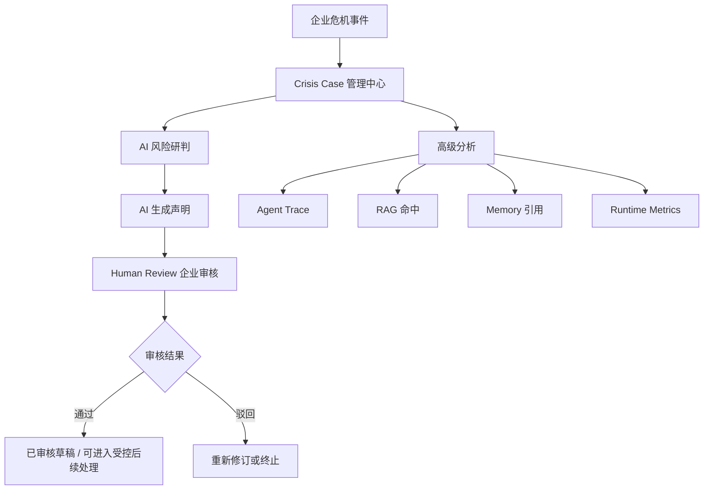
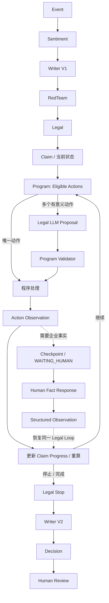
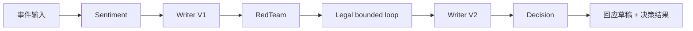
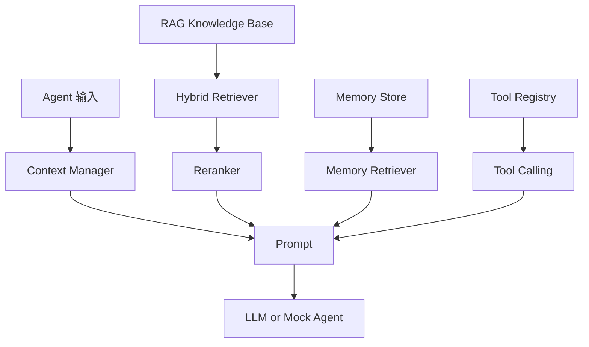
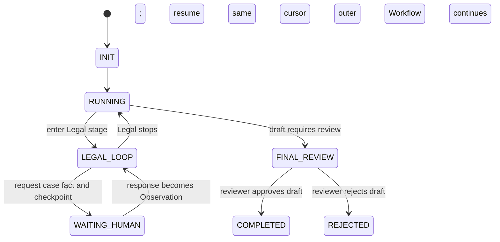
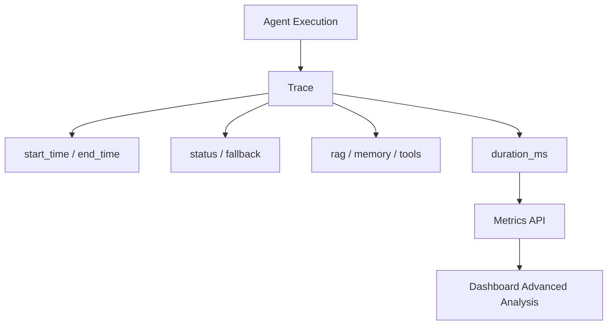

# CrisisAgent Architecture Diagram

本文档用图示方式说明 CrisisAgent 的产品结构、Dynamic Runtime、Agent 协作和可观测链路，方便 GitHub 展示和面试讲解。

## 1. 产品视角

```mermaid
flowchart TD
    A["企业危机事件"] --> B["Crisis Case 管理中心"]
    B --> C["AI 风险研判"]
    C --> D["AI 生成声明"]
    D --> E["Human Review 企业审核"]
    E --> F{"审核结果"}
    F -->|通过| G["已审核草稿 / 可进入受控后续处理"]
    F -->|驳回| H["重新修订或终止"]
    B --> I["高级分析"]
    I --> J["Agent Trace"]
    I --> K["RAG 命中"]
    I --> L["Memory 引用"]
    I --> M["Runtime Metrics"]
```

## 2. 固定外层 Workflow 与 Legal 内部循环

```mermaid
flowchart TD
    A["Event"] --> S["Sentiment"] --> W1["Writer V1"] --> R["RedTeam"] --> L["Legal"]
    L --> C["Claim / 当前状态"] --> E["Program: Eligible Actions"]
    E -->|唯一动作| X["程序处理"]
    E -->|多个有意义动作| P["Legal LLM Proposal"] --> V["Program Validator"] --> X
    X --> O["Action Observation"] --> U["更新 Claim Progress / 重算"]
    U -->|继续| E
    U -->|停止 / 完成| LS["Legal Stop"] --> W2["Writer V2"] --> D["Decision"] --> H["Human Review"]
    O -. 需要企业事实 .-> WF["Checkpoint / WAITING_HUMAN"]
    WF --> FR["Human Fact Response"] --> HO["Structured Observation"]
    HO -. 恢复同一 Legal Loop .-> U
```

## 3. Agent 协作链路

```mermaid
flowchart LR
    A["事件输入"] --> B["Sentiment"]
    B --> C["Writer V1"]
    C --> D["RedTeam"]
    D --> E["Legal bounded loop"]
    E --> F["Writer V2"]
    F --> G["Decision"]
    G --> H["回应草稿 + 决策结果"]
```

## 4. RAG / Memory / Tools 位置

```mermaid
flowchart TD
    A["Agent 输入"] --> B["Context Manager"]
    B --> C["Prompt"]
    D["RAG Knowledge Base"] --> E["Hybrid Retriever"]
    E --> F["Reranker"]
    F --> C
    G["Memory Store"] --> H["Memory Retriever"]
    H --> C
    I["Tool Registry"] --> J["Tool Calling"]
    J --> C
    C --> K["LLM or Mock Agent"]
```

## 5. Human Gate 与 Resume

```mermaid
stateDiagram-v2
    [*] --> INIT
    INIT --> RUNNING
    RUNNING --> LEGAL_LOOP: enter Legal stage
    LEGAL_LOOP --> WAITING_HUMAN: request case fact and checkpoint
    WAITING_HUMAN --> LEGAL_LOOP: response becomes Observation; resume same cursor
    LEGAL_LOOP --> RUNNING: Legal stops; outer Workflow continues
    RUNNING --> FINAL_REVIEW: draft requires review
    FINAL_REVIEW --> COMPLETED: reviewer approves draft
    FINAL_REVIEW --> REJECTED: reviewer rejects draft
```

Human Review approves or rejects a draft; approval does not publish it automatically.

## 6. Observability

```mermaid
flowchart TD
    A["Agent Execution"] --> B["Trace"]
    B --> C["start_time / end_time"]
    B --> D["status / fallback"]
    B --> E["rag / memory / tools"]
    B --> F["duration_ms"]
    F --> G["Metrics API"]
    G --> H["Dashboard Advanced Analysis"]
```

## 面试讲解重点

- 系统不是单 LLM，而是一个可编排 Agent Runtime。
- Agent 之间不直接互相调用，而是通过 AgentState 共享结果。
- RAG 放在 Legal Agent，Memory 放在 Writer Agent，职责边界清晰。
- Human Gate 保证高风险场景不会完全自动化发布。
- Checkpoint Resume 让审核中断后的 runtime 可以恢复。
- Dashboard 面向业务用户，高级分析面向开发和调试。
