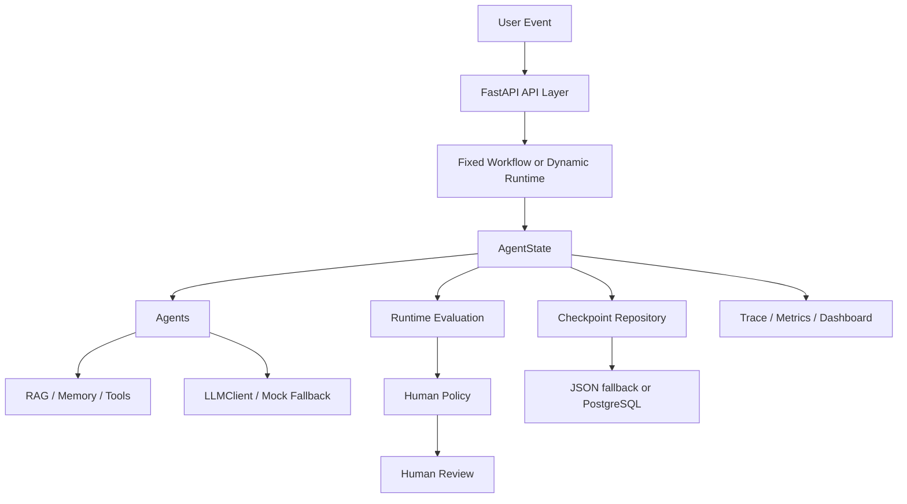
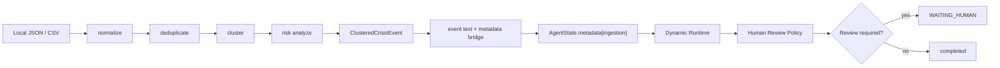
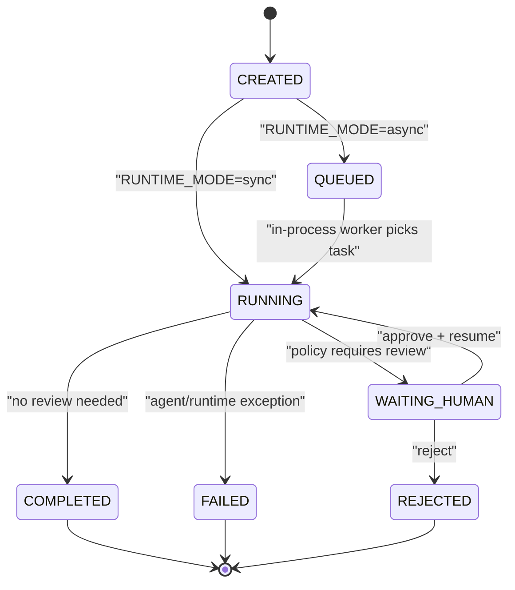
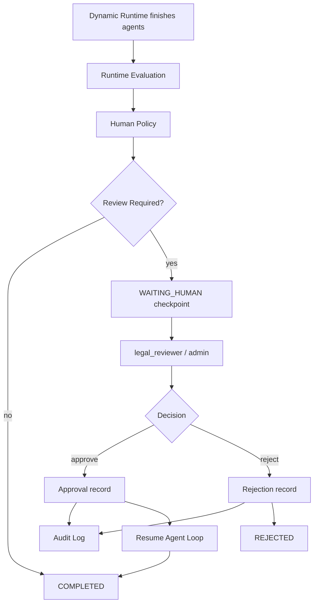
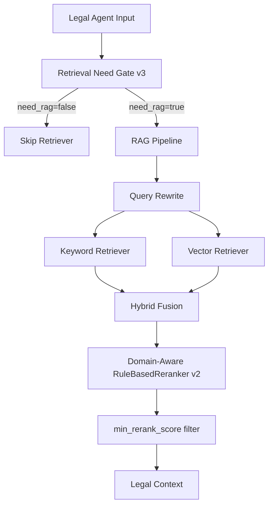
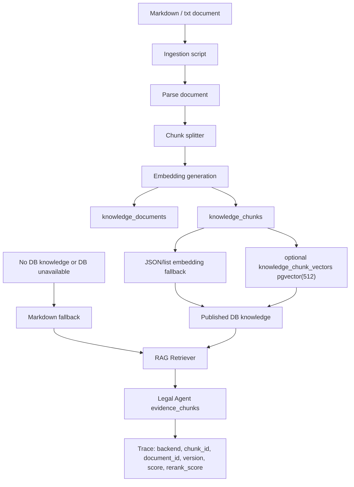
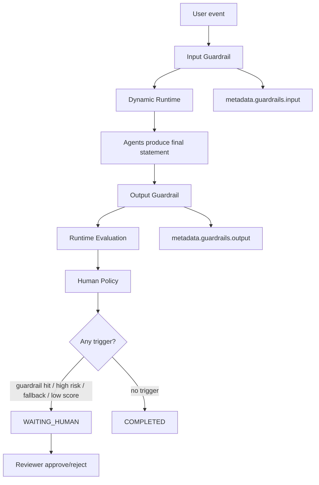

# CrisisAgent Architecture

本文档说明 CrisisAgent v3.0.0 的真实工程结构。项目核心仍是企业危机响应 Agent Runtime；生产化阶段补充了持久化、异步执行、认证审计、Guardrails、知识库管理和可观测性，但没有替换 Agent 业务逻辑或 Prompt 语义。

## 1. System Overview



两条运行链路并存：

- Fixed Workflow：`backend/workflow.py`，固定执行顺序，适合回归和对比。
- Dynamic Runtime：`backend/core/dynamic_runtime.py`，Planner 生成计划，Validator 补齐依赖，Executor 按计划执行 Agent。

## 1.1 Sentiment Ingestion 与 Metadata Bridge

第一阶段的舆情入口使用本地 JSON/CSV fixture，不访问外部网络。它先把多条来源整理成结构化事件，再交给现有 Runtime：



`run_dynamic_sync_with_metadata()` 是内部的非破坏性入口。它仍然使用原有 Agent、Executor、RAG 和 checkpoint，只额外把 `ClusteredCrisisEvent.to_dict()` 写入 `AgentState.metadata["ingestion"]`。原有 `run_dynamic_sync(event)` 和 API contract 保持不变。

Policy 会读取 ingestion namespace 中的 `human_review_required`、`risk_level`、`fact_status` 和 `event_status`，生成例如 `ingestion_review_required`、`ingestion_high_risk`、`ingestion_fact_conflicting` 和 `ingestion_event_uncertain` 等原因。metadata 会随 checkpoint 保存，因此 resume 时仍能恢复原始来源和风险上下文。

当前边界：这是离线 fixture + mock workflow 的集成验证，不是实时全网舆情监控，不代表已经接入真实企业生产数据，也不包含自动发布声明。未来若接入 RSS、Webhook 或其他外部来源，应在此 bridge 之前增加来源授权、幂等、限流、冲突证据治理和历史事件过滤。

### 面试讲解

**1 分钟版：**

> 我在原有危机响应 Agent 前增加了一个轻量 ingestion 层。它把本地 JSON/CSV 中的多条舆情先做规范化、去重、聚类和风险分析，生成 `ClusteredCrisisEvent`。之前 Runtime 只接收 event 字符串，ingestion 判断出的事实冲突、未证实和人工审核要求没有真正参与运行时策略。因此我增加了内部 metadata bridge，把结构化结果写入 `AgentState.metadata["ingestion"]`，再由 Human Review Policy 统一判断，必要时进入 `WAITING_HUMAN`。这没有改变原有 API、Agent 顺序或 Prompt，当前通过离线 fixture 和 mock workflow 验证了从舆情归并到人工审核的闭环。

**30 秒版：**

> 我补了一层离线舆情 ingestion，把多条来源规范化、去重、聚类成结构化事件，并通过 metadata bridge 写入 AgentState。这样事实未证实、来源冲突或高风险事件不只是停留在分析结果里，而是能被 Human Review Policy 读取并触发 `WAITING_HUMAN`。目前是 fixture + mock 验证，不是实时爬虫或已上线生产系统。

**STAR 版：**

> **S：** 原系统主要接收人工组织的一条事件文本，不够接近真实企业舆情输入，而且 ingestion 层的审核判断没有进入 Runtime。**T：** 在不修改现有 API、Agent 顺序和 Prompt 的前提下，让多来源舆情的结构化风险能够影响人工审核。**A：** 增加 normalize、deduplicate、cluster、risk analyze 流程，并通过内部 metadata bridge 将 `ClusteredCrisisEvent` 写入 `AgentState.metadata["ingestion"]`，由 Human Review Policy 根据高风险、事实未证实、来源冲突和事件不确定状态生成可追踪 trigger。**R：** 本地 fixture 聚合结果可以进入现有 Dynamic Runtime，高风险事件真实进入 `WAITING_HUMAN`，全量测试保持通过；当前结果只证明离线 mock 闭环，不夸大为实时监控或生产部署。

## 2. Planner / Executor / AgentState

Dynamic Runtime 的核心是把 Agent 调用从“函数链”拆成可检查状态机：

- `planner_agent.py`：根据事件生成初始 plan。
- `plan_validator.py`：验证并补齐依赖，确保顺序为 sentiment -> writer -> redteam -> legal -> writer_v2 -> decision。
- `executor.py`：调用 Agent Adapter，将每个 Agent 输出写入 `state.results`，同时写入 `state.trace`。
- `state.py`：保存 session、plan、event、results、trace、approval、metadata、failed_agents 和 current_agent。

`AgentState` 的状态包括：



状态机校验防止无效状态跳转。

边界说明：async runtime 默认是进程内 worker；也可以通过 `TASK_QUEUE_BACKEND=rq` 使用 Redis + RQ。in-process 模式下服务重启会丢失尚未执行的内存队列任务。

## 3. Dynamic Runtime

`POST /api/dynamic/run` 在 sync 模式下会同步执行完整 runtime；在 async 模式下只创建 session、保存初始 checkpoint、提交后台任务并立即返回 queued。

关键模块：

- `backend/core/dynamic_runtime.py`
- `backend/core/executor.py`
- `backend/core/runtime_tasks.py`
- `backend/core/checkpoint.py`
- `backend/core/resume.py`

## 4. Async Runtime

通过 `RUNTIME_MODE` 切换：

- `RUNTIME_MODE=sync`：保持旧行为，HTTP 请求等待完整 Agent 流程结束。
- `RUNTIME_MODE=async`：使用 in-process `ThreadPoolExecutor` 后台执行。

异步模式会保存：

- `QUEUED`
- `RUNNING`
- `WAITING_HUMAN`
- `COMPLETED`
- `FAILED`
- `REJECTED`

已知限制：

- 这是进程内 worker，不是分布式队列。
- 服务重启会丢失尚未执行的内存队列任务。
- 多进程部署时 worker pool 不共享。
- 生产化长任务建议使用 Redis + RQ 或其他 durable queue，而不是默认 in-process worker。

## 5. Human Review

Human Review 由 `backend/core/policy.py` 和 `backend/core/human.py` 驱动。

会触发人工审核的情况包括：

- high-risk event
- evaluation failed or low scores
- guardrail hit
- LLM fallback observed

`approve` / `reject` 会更新 `AgentState.approval`，写入 trace，并通过 checkpoint repository 持久化。



## 6. Checkpoint / Resume

`backend/core/checkpoint.py` 提供统一接口：

```python
save_checkpoint(state)
load_checkpoint(session_id)
list_checkpoints()
delete_checkpoint(session_id)
```

底层通过 repository 实现：

- JSON fallback：默认本地文件，便于测试和 demo。
- PostgreSQL：生产化路径，保存 session、checkpoint、trace、approval、evaluation 和 audit logs。

Resume 入口位于 `backend/core/resume.py`。当 WAITING_HUMAN checkpoint 被 approved 后，runtime 可以恢复后续执行。

## 7. Legal RAG

Legal Agent 的 RAG 链路：



RAG trace 区分：

- Gate Skip：`retrieval_skipped=true`
- Executed No Hit：`retrieval_executed=true` 且 `count=0`
- Executed With Hits：`count>0`
- Retrieval Error：`fallback_used=true`

默认 demo 不使用 pgvector、ANN index、BM25、RRF 或 Cross Encoder；Phase 12 提供可选 pgvector backend，但不改变默认 JSON/list fallback。

## 7.1 RAG Knowledge Management Flow



边界说明：默认 embedding 以 JSON/list 结构保存和读取；pgvector 是可选生产化增强，需要 PostgreSQL `vector` extension 和 `VECTOR_BACKEND=pgvector`。Knowledge management 用于可审计 ingestion 和 evidence trace，不等同于完整企业知识库管理后台。

治理过滤：database-backed RAG 默认只检索 `status=published` 且 `is_enabled=true` 的文档；`draft` 和 `disabled` 文档仍可通过 listing 脚本审计，但不会进入 Legal Agent 检索上下文。

## 8. Guardrails

Guardrails 位于 `backend/guardrails/`：

- `prompt_injection.py`：检测用户输入中的 prompt injection。
- `input_guardrail.py`：输入侧风险封装。
- `output_guardrail.py`：检测最终声明中的高风险措辞。

输出侧规则覆盖：

- 绝对承诺
- 未核实事实定性
- 直接承认违法
- 隐私信息泄露
- 跳过人工审核暗示

Guardrail 命中后不会自动修改 Agent 输出，而是进入 Human Review。



## 9. Auth / RBAC

Auth 位于 `backend/auth.py`，新增 API：

- `POST /api/auth/login`
- `GET /api/auth/me`

角色：

- `operator`：创建 case，查看自己创建的 case。
- `legal_reviewer`：可以 approve/reject。
- `admin`：可以查看全部 case 和审核。

`AUTH_ENABLED=false` 时保持 demo 行为；`AUTH_ENABLED=true` 时 approve/reject 必须携带 JWT，且只允许 `legal_reviewer` 或 `admin`。

## 10. Observability

新增模块：

- `backend/observability/logger.py`
- `backend/observability/metrics.py`
- `backend/observability/readiness.py`

API：

- `GET /health`：服务存活检查。
- `GET /ready`：检查 checkpoint backend、database、worker、required env、auth secret。
- `GET /api/metrics/runtime`：聚合 runtime metrics。

Metrics 字段包括 session 状态、Agent failure、LLM call/fallback、Guardrail trigger、RAG hit/fallback、approval/rejection 和平均 runtime latency。

## 11. PostgreSQL / Alembic

PostgreSQL production path 包含：

- `crisis_sessions`
- `agent_checkpoints`
- `agent_traces`
- `approvals`
- `evaluations`
- `audit_logs`
- `users`
- `knowledge_documents`
- `knowledge_chunks`
- `knowledge_chunk_vectors` optional pgvector storage

Knowledge governance fields include `status`, `is_enabled`, `version`, `source_category`, `title`, `source_name`, `created_at`, and `updated_at`.

迁移使用 Alembic：

```bash
python -m alembic upgrade head
```

JSON fallback 仍是默认路径，普通 pytest 不要求启动 PostgreSQL 或 pgvector。
